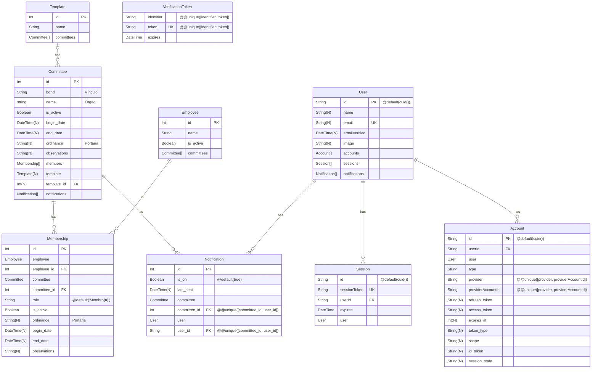

# Committee Management System (2.0!)

This is a [T3 Stack](https://create.t3.gg/) project bootstrapped with `create-t3-app`.
To learn more about the [T3 Stack](https://create.t3.gg/), take a look at the following resources:

- [Documentation](https://create.t3.gg/)
- [Learn the T3 Stack](https://create.t3.gg/en/faq#what-learning-resources-are-currently-available) — Check out these awesome tutorials

## Featuring

- [Next.js](https://nextjs.org)
- [NextAuth.js](https://next-auth.js.org)
- [Prisma](https://prisma.io)
- [Tailwind CSS](https://tailwindcss.com)
- [tRPC](https://trpc.io)
- [shadcn/ui](https://ui.shadcn.com/)
- [React Hook Form](https://react-hook-form.com/)
- [Zod](https://zod.dev/)
- [Nodemailer](https://nodemailer.com/)
- [Nodemailer](https://nodemailer.com/)

## Deploy

- [Vercel](https://vercel.com/)
- [PlanetScale](https://planetscale.com/)
- [Axiom](https://axiom.co/)

## See more

- https://next-auth.js.org/getting-started/client
- https://www.prisma.io/docs/concepts/components/prisma-schema/relations/relation-mode#indexes
- https://www.prisma.io/docs/guides/database/planetscale#differences-to-consider
- https://tanstack.com/table/v8/docs/api/features/pagination
- https://next-auth.js.org/providers/email
- https://next-auth.js.org/configuration/options#session
- https://trpc.io/docs/client/nextjs/ssg

## ER Diagram

You can use the [bierner.markdown-mermaid](https://marketplace.visualstudio.com/items?itemName=bierner.markdown-mermaid) extension to visualize your mermaid diagram on VSCode

